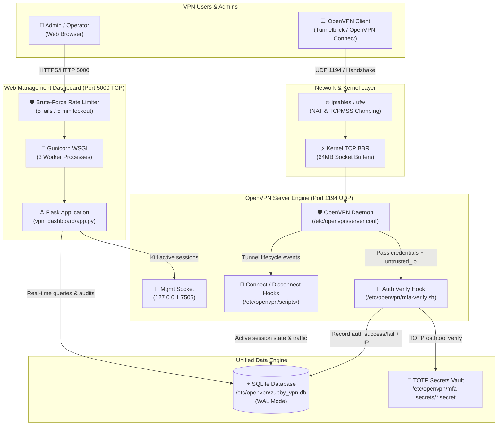
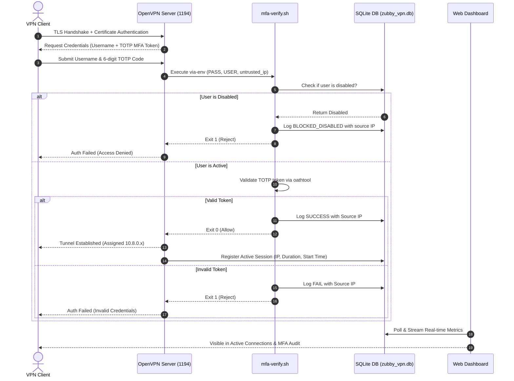

# Zubby VPN - OpenVPN MFA Setup & Real-time Dashboard

Enterprise-grade OpenVPN infrastructure integrating **Time-based One-Time Password (TOTP) Multi-Factor Authentication (MFA)**, connection telemetry hooks, high-throughput network kernel optimizations, a centralized **SQLite** storage engine, and a modern, dark/light themed web management dashboard.

---

## 📑 Table of Contents
1. [Architecture & System Overview](#-architecture--system-overview)
2. [Sequence & Lifecycle Workflow](#-sequence--lifecycle-workflow)
3. [Key Features](#-key-features)
4. [Prerequisites](#-prerequisites)
5. [Step-by-Step Installation Procedure](#-step-by-step-installation-procedure)
   - [Step 1: OpenVPN Server & Network Engine Setup](#step-1-openvpn-server--network-engine-setup)
   - [Step 2: Dashboard Deployment & Service Setup](#step-2-dashboard-deployment--service-setup)
   - [Step 3: Accessing the Dashboard](#step-3-accessing-the-dashboard)
6. [Client Onboarding & Connection Guide](#-client-onboarding--connection-guide)
7. [Operational & Administration Procedures](#-operational--administration-procedures)
   - [Client Management (Web & CLI)](#client-management-web--cli)
   - [Instant Live Session Termination (Kick)](#instant-live-session-termination-kick)
   - [Disabling & Enabling Access](#disabling--enabling-access)
   - [Audit Logs, Date Filtering & Excel/PDF Exports](#audit-logs-date-filtering--excelpdf-exports)
   - [Role-Based Access Control (RBAC)](#role-based-access-control-rbac)
8. [Performance & Security Hardening](#-performance--security-hardening)
9. [Project File Structure](#-project-file-structure)
10. [Troubleshooting & Diagnostics](#-troubleshooting--diagnostics)

---

## 🏛 Architecture & System Overview

The diagram below illustrates the end-to-end architecture across OpenVPN, SQLite, the Linux Kernel, and the Gunicorn/Flask Web Dashboard:



---

## 🔄 Sequence & Lifecycle Workflow

### MFA Authentication & Connection Handshake


---

## 🚀 Key Features

- **🛡️ TOTP Multi-Factor Authentication**: Every client profile is paired with a distinct TOTP secret compatible with Google Authenticator, Microsoft Authenticator, and Authy.
- **⚡ High-Performance SQLite Backend**: Replaced fragmented flat files with `/etc/openvpn/zubby_vpn.db` utilizing Write-Ahead Logging (WAL) for high concurrency.
- **🚀 Production WSGI (Gunicorn)**: Dashboard runs as a native `systemd` service managed by Gunicorn with multi-worker scaling.
- **🌐 Network Speed Optimization**: Integrated Google **BBR congestion control**, expanded 64MB buffer windows, and **TCPMSS clamping** to eliminate MTU packet fragmentation and latency jitter.
- **⚡ Instant Session Termination (Kick)**: Direct socket connection to OpenVPN Management (`127.0.0.1:7505`) terminates live user sessions immediately.
- **📈 Advanced Audit & Report Exporting**:
  - Filter by date range (`from_date` to `to_date`) and client/IP search.
  - Native Excel (`.xlsx`) generated via `openpyxl` & `pandas`.
  - Printable executive PDF reports generated via ReportLab.
- **🔒 Web Login Brute-Force Rate Limiting**: Automatic IP lockout (5 failed attempts within 5 minutes results in a 5-minute freeze).
- **🎨 Glassmorphic Dark/Light Mode**: Responsive Bootstrap 5 UI with unified corner rail navigation, zero layout clipping, and real-time live traffic charts.

---

## 📋 Prerequisites

- **Supported Operating Systems**: Ubuntu 20.04/22.04/24.04 LTS, Debian 11/12, Rocky Linux / CentOS 8/9.
- **Permissions**: Root access (`sudo`).
- **Firewall Ports**:
  - `1194/udp`: OpenVPN tunnel port (or custom port).
  - `5000/tcp`: Dashboard web interface.
- **Core Utilities**: `curl`, `git`, `python3`, `python3-pip`, `python3-venv`, `sqlite3`, `oathtool`.

---

## 🛠 Step-by-Step Installation Procedure

### Step 1: OpenVPN Server & Network Engine Setup

Clone the repository and run the primary OpenVPN initialization script as root:

```bash
git clone https://github.com/Naveen-kumar-78/OpenVPN-MFA-Setup-and-Dashboard.git /root/OpenVPN-MFA-Setup-and-Dashboard
cd /root/OpenVPN-MFA-Setup-and-Dashboard

# Execute OpenVPN, PKI, and network optimization installer
sudo bash ovpn.sh
```

What this step configures:
1. Installs OpenVPN, Easy-RSA, `oathtool`, and `sqlite3`.
2. Generates PKI CA, Server Certificates, Diffie-Hellman parameters, and TLS-Crypt keys.
3. Initializes the SQLite database schema (`/etc/openvpn/zubby_vpn.db`) with indexing.
4. Applies kernel network tuning to `/etc/sysctl.d/99-openvpn.conf` (enables BBR and large buffer queues).
5. Configures `iptables` NAT forwarding and TCPMSS clamping.
6. Starts and enables the `openvpn@server` systemd service.

---

### Step 2: Dashboard Deployment & Service Setup

Deploy the web dashboard, Python virtual environment, dependencies, and systemd service:

```bash
# Execute the dashboard deployment script
sudo bash vpn.sh
```

What this step configures:
1. **Privilege Separation**: Creates an unprivileged system daemon user `vpnadmin` (with a `/usr/sbin/nologin` shell) and an `openvpn` system group.
2. **Sudoers Whitelist**: Configures `/etc/sudoers.d/vpnadmin` with a strict `NOPASSWD` rule restricted solely to `/usr/local/bin/client.sh` (least privilege principle).
3. **Application Root**: Deploys the web app to `/opt/vpn_dashboard` with ownership `vpnadmin:openvpn` (permissions `0750`).
4. **Client Vault**: Sets up `/etc/openvpn/clients` with group-readable permissions for safe profile downloads (symlinked to `/root/ovpn_clients`).
5. **Database Permissions**: Grants group `openvpn` read/write access to `/etc/openvpn/zubby_vpn.db`.
6. **Hardened Systemd Service**: Deploys `/etc/systemd/system/vpn_dashboard.service` running as `User=vpnadmin` and `Group=openvpn` with 3 Gunicorn workers.
7. Starts and enables `vpn_dashboard.service`.

Verify that the dashboard service is active:
```bash
sudo systemctl status vpn_dashboard
```

---

### Step 3: Accessing the Dashboard

Open your browser and navigate to:
```
http://<your-server-ip>:5000
```

#### Default Credentials:
| Username | Password | Role | Permissions |
| :--- | :--- | :--- | :--- |
| **`admin`** | `admin123` | Administrator | Full access: User management, client creation/revocation, session kicking, system audits |
| **`operator`** | `operator123` | Read/Write | Client management, profile downloads, log downloads, session kicking |
| **`viewer`** | `viewer123` | Read-Only | Read-only visibility: Live activity, audit logs, and reports |

> [!IMPORTANT]
> Change default passwords immediately under the **User Management** section (`/user_management`) upon first login.

---

## 📱 Client Onboarding & Connection Guide

### 1. Generating a Client Profile
You can generate a client via the web UI or CLI:
- **Web UI**: Go to **Client Management** (`/client_management`), type the client name (e.g. `john.doe`), and click **Generate Client (.ovpn)**.
- **CLI**:
  ```bash
  sudo bash client.sh --create john.doe
  ```

### 2. Setting up Multi-Factor Authentication (MFA)
When the client is created:
1. An OTP authentication secret is generated in `/etc/openvpn/mfa-secrets/john.doe.secret`.
2. A QR Code and manual secret key are displayed in the terminal and in the dashboard profile download view.
3. Open your authenticator app (**Google Authenticator**, **Microsoft Authenticator**, or **Authy**) and scan the QR code or enter the secret key manually.

### 3. Connecting to the VPN
1. Download the generated `john.doe.ovpn` profile.
2. Import the file into your OpenVPN client:
   - **Windows**: OpenVPN GUI or OpenVPN Connect
   - **macOS**: Tunnelblick or OpenVPN Connect
   - **Linux**: `sudo openvpn --config john.doe.ovpn`
   - **iOS / Android**: OpenVPN Connect App
3. When prompted for credentials:
   - **Username**: `john.doe`
   - **Password**: Enter the **6-digit TOTP code** generated by your authenticator app.

---

## ⚙️ Operational & Administration Procedures

### Client Management (Web & CLI)

```bash
# Interactive menu mode
sudo bash client.sh

# Fast CLI commands
sudo bash client.sh --create <client_name>    # Provision certificate & MFA secret
sudo bash client.sh --status <client_name>    # Inspect client state & connection
sudo bash client.sh --disable <client_name>   # Temporarily block access
sudo bash client.sh --enable <client_name>    # Restore access
sudo bash client.sh --kick <client_name>      # Drop active tunnel session
sudo bash client.sh --revoke <client_name>    # Permanently revoke certificate
```

---

### Instant Live Session Termination (Kick)
When an administrator clicks **Kick** on the dashboard or runs `client.sh --kick <name>`:
1. The dashboard opens a socket connection to OpenVPN's localhost management interface (`127.0.0.1:7505`).
2. Dispatches `kill <client_name>\r\n`.
3. OpenVPN immediately terminates the client tunnel, closes the virtual adapter, and releases the assigned IP.
4. The active session record in SQLite is updated in real time.

---

### Disabling & Enabling Access
- **Disable Client**: Blocks the client from authenticating without destroying certificates or MFA secrets. The client is recorded in the `disabled_clients` table and synced to `/etc/openvpn/disabled_clients.txt`.
- **Enable Client**: Instantly restores the client's ability to authenticate.

---

### Audit Logs, Date Filtering & Excel/PDF Exports
All system and tunnel events are recorded with source IP addresses and timestamps:
1. **Search & Date Filters**:
   - Filter by date range (`From Date` and `To Date`).
   - Search by client name, remote IP, or outcome status.
2. **Export Formats**:
   - **Excel (`.xlsx`)**: Native workbooks generated via `openpyxl` with styled headers.
   - **PDF**: Professional vector tables with summary headers and event timestamps.
3. **Available Export Streams**:
   - **Connection Audit**: `/export/vpn/excel` & `/export/vpn/pdf`
   - **MFA Authentication Trail**: `/export/mfa/excel` & `/export/mfa/pdf`
   - **System Administrative Trail**: `/export/audit/excel` & `/export/audit/pdf`

---

### Role-Based Access Control (RBAC)
Role definitions configured in [`app.py`](file:///d:/turbo/OpenVPN-MFA-Setup-and-Dashboard/vpn_dashboard/app.py):
- **Admin**: Full administrative permissions including user provisioning and audit logs.
- **Operator / ReadWrite**: Client management, profile generation, kicking, and report downloads.
- **Viewer / ReadOnly**: Observability and log viewing only.

---

## 🔒 Performance & Security Hardening

### 1. Eliminating Internet Slowness (MTU & Buffer Tuning)
Standard OpenVPN tunnels suffer from TCP throughput degradation when 1500-byte packets exceed interface MTUs. Zubby VPN eliminates this with:
- **TCPMSS Clamping**:
  ```bash
  iptables -t mangle -A FORWARD -p tcp --tcp-flags SYN,RST SYN -j TCPMSS --clamp-mss-to-pmtu
  ```
- **Google BBR Congestion Control & 64MB Buffers**:
  ```ini
  net.core.default_qdisc = fq
  net.ipv4.tcp_congestion_control = bbr
  net.core.rmem_max = 67108864
  net.core.wmem_max = 67108864
  ```
- **Socket Buffer Directives**:
  `tun-mtu 1500`, `mssfix 1420`, `sndbuf 524288`, and `rcvbuf 524288`.

### 2. Dashboard Security
- **Salted Password Hashing**: Passwords stored via Werkzeug Scrypt/PBKDF2.
- **Login Rate Limiter**: 5 consecutive failed logins triggers a 5-minute IP lockout (`HTTP 429 Too Many Requests`).
- **Session Security**: Session cookies use `SameSite=Lax` and persistent secret tokens.
- **Path Traversal Protection**: Secure filename sanitization prevents directory escape attacks during `.ovpn` downloads.

---

## 📂 Project File Structure

```plaintext
OpenVPN-MFA-Setup-and-Dashboard/
├── ovpn.sh                       # OpenVPN server installer, PKI setup & MFA hook
├── vpn.sh                        # Dashboard installer & Gunicorn systemd deployment
├── client.sh                     # Interactive and flag-based client management CLI
├── README.md                     # Comprehensive documentation & architecture guide
└── vpn_dashboard/                # Flask web application
    ├── app.py                    # Controllers, SQLite schema, REST endpoints & export logic
    ├── requirements.txt          # Python dependencies (Flask, Gunicorn, openpyxl, etc.)
    └── templates/                # Jinja2 templates (dark/light theme responsive UI)
        ├── enhanced_dashboard.html # Main dashboard: metrics, active users, connections & MFA logs
        ├── client_management.html  # Client provisioning, download, disable, enable & revoke
        ├── user_management.html    # Dashboard web admin user accounts & RBAC
        ├── audit_logs.html         # Administrative event trail with search & date filters
        ├── clients.html            # Client lifecycle activity timeline
        ├── login.html              # Secure login interface with rate-limiting alerts
        └── error.html              # Standardized application error handler
```

---

## 🔍 Troubleshooting & Diagnostics

### Check Service Health
```bash
# Check OpenVPN server status
sudo systemctl status openvpn@server

# Check Web Dashboard status
sudo systemctl status vpn_dashboard

# View real-time Gunicorn dashboard logs
sudo journalctl -u vpn_dashboard -f

# View OpenVPN server connection logs
sudo tail -f /var/log/openvpn/openvpn.log
```

### Test OpenVPN Management Socket
Verify that the management interface is accepting commands:
```bash
echo "status" | nc 127.0.0.1 7505
```

### Inspect SQLite Database Tables
```bash
sqlite3 /etc/openvpn/zubby_vpn.db "SELECT * FROM active_sessions;"
sqlite3 /etc/openvpn/zubby_vpn.db "SELECT * FROM mfa_logs ORDER BY timestamp DESC LIMIT 5;"
```

### Reset Forgotten Admin Password
```bash
python3 -c "
import sqlite3
from werkzeug.security import generate_password_hash
conn = sqlite3.connect('/etc/openvpn/zubby_vpn.db')
conn.execute('UPDATE users SET password_hash = ? WHERE username = ?', (generate_password_hash('NewPassword123'), 'admin'))
conn.commit()
conn.close()
print('Admin password reset successfully')
"
```

---

## 📄 License
This project is open-source and licensed under the MIT License.
